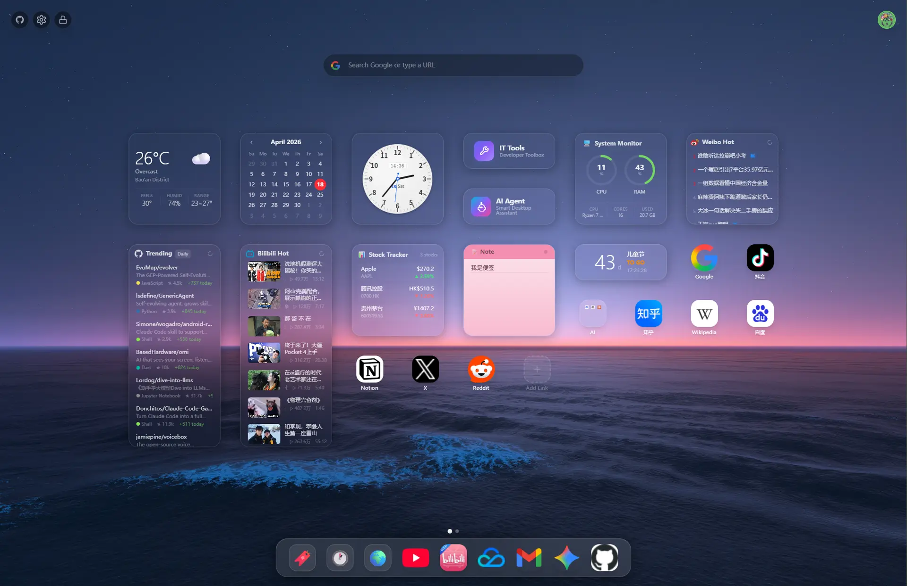
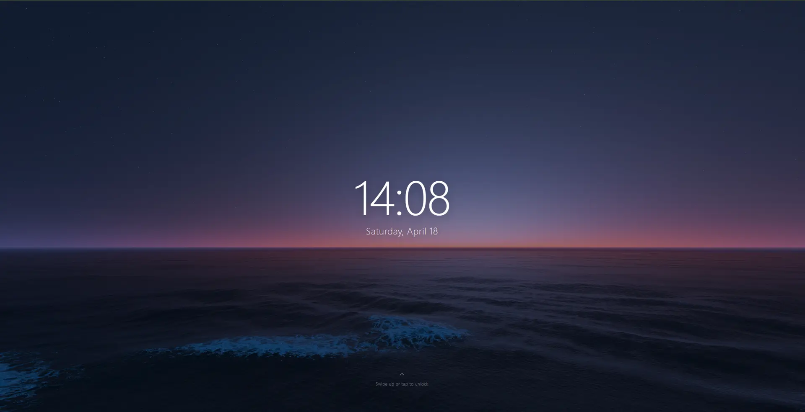
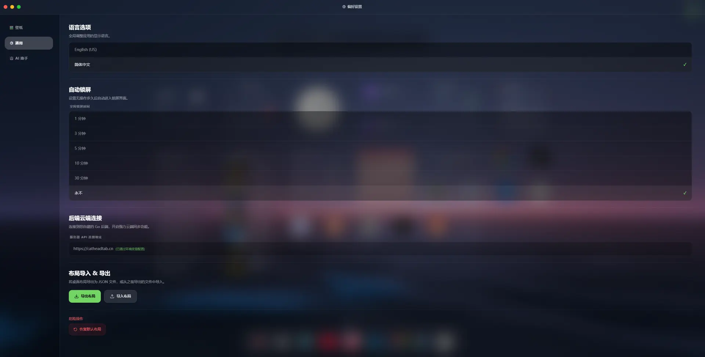
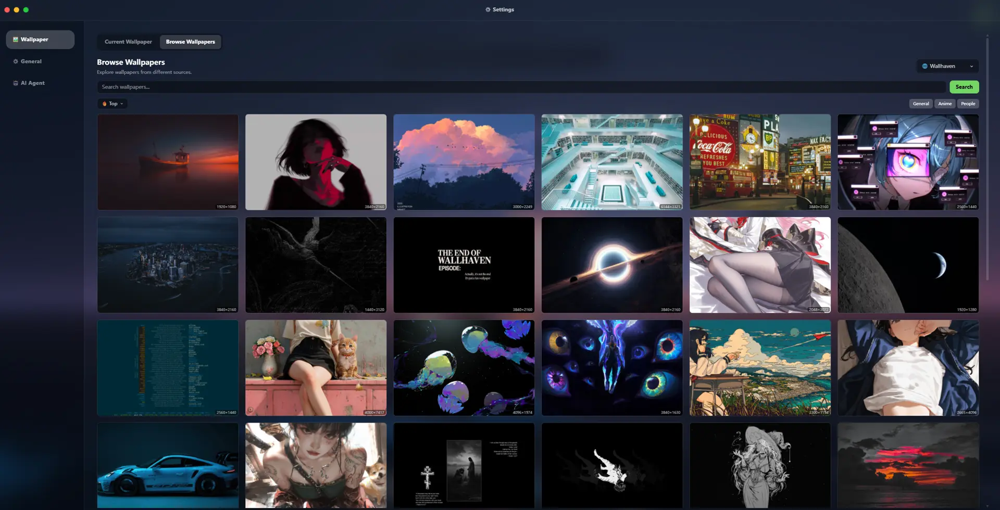
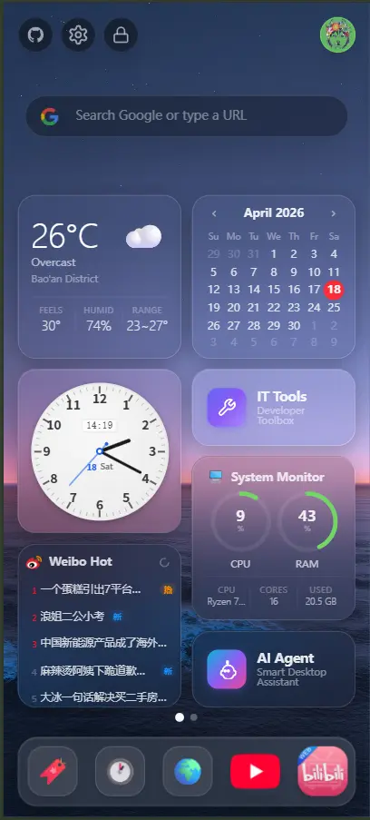
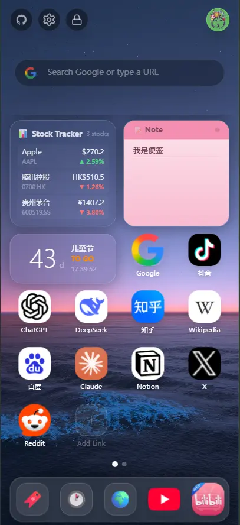

<div align="center">

# CatHeadTab

**A beautiful, AI-powered browser new tab — your personal digital hub.**

<div align="center">
  
  <p><i>Smart Folder Organization — Smooth transitions powered by FLIP engine</i></p>
</div>

## Preview

| Lock Screen | Settings Panel |
| :---: | :---: |
|  |  |

<div align="center">
  
  <p><i>Wallpaper Selection — Support for Wallhaven & Cloud library</i></p>
</div>

| Mobile Adaptation 1 | Mobile Adaptation 2 |
| :---: | :---: |
|  |  |

[](https://catheadtab.cn/) [](LICENSE) [](https://developer.chrome.com/docs/extensions/mv3/) [](https://go.dev/) [](https://react.dev/) [](https://www.postgresql.org/)

[**中文**](README.md) | English

[Features](#features) | [Quick Start](#quick-start) | [Self-Hosting](#self-hosting) | [Tech Stack](#tech-stack) | [License](#license)

</div>

---

## Features

### Desktop Experience

<!-- TODO: Add desktop GIF -->
<!--  -->

- **iOS/macOS-style Desktop** — Multi-page grid layout with Dock bar, drag-to-reorder, drag-to-merge into folders, cross-page moves, FLIP animation engine for silky-smooth transitions
- **Lock Screen** — Configurable idle auto-lock with large clock display, swipe/click to unlock
- **Multi-mode Search Bar** — Switch between Google, Bing, Bookmarks, History, and Desktop icon filter

### AI Desktop Assistant

<!-- TODO: Add AI assistant GIF -->
<!--  -->

An intelligent assistant that truly understands your desktop and can take actions — not just chat.

#### 20 Built-in Skills

| Category | Skill | Description |
|----------|-------|-------------|
| **Desktop** | `listDesktopItems` | View all icons, folders, and widgets on the desktop |
| | `addDesktopItem` | Add a website shortcut to the desktop |
| | `removeDesktopItem` | Remove a desktop item |
| | `createFolder` | Create a new folder |
| | `moveItemToFolder` | Move an icon into a folder |
| | `renameItem` | Rename a desktop item |
| | `organizeDesktop` | **Auto-organize desktop** — analyzes icon URLs and titles, batch-creates categorized folders |
| **Bookmarks** | `searchBookmarks` | Search browser bookmarks |
| | `listBookmarkFolders` | List bookmark folder structure |
| | `getRecentBookmarks` | Get recently added bookmarks |
| **History** | `searchHistory` | Search browsing history |
| | `getRecentHistory` | Get recent visits |
| **Settings** | `changeWallpaper` | Change wallpaper by URL |
| | `changeLanguage` | Switch UI language (zh/en) |
| | `getSystemInfo` | Get system configuration info |
| **Trending** | `getGithubTrending` | GitHub trending repositories today |
| | `getBilibiliHot` | Bilibili popular videos |
| | `getWeiboHot` | Weibo real-time hot search |
| | `getXiaohongshuHot` | Xiaohongshu (RED) hot topics |
| | `getBBCNews` | BBC News headlines |

#### 8 LLM Providers

| Provider | Default Model | Base URL |
|----------|--------------|----------|
| OpenAI | `gpt-4o-mini` | `https://api.openai.com/v1` |
| Anthropic | `claude-sonnet-4-20250514` | `https://api.anthropic.com/v1` |
| Google | `gemini-2.0-flash` | `https://generativelanguage.googleapis.com/v1beta/openai` |
| DeepSeek | `deepseek-chat` | `https://api.deepseek.com/v1` |
| GLM (Zhipu) | `glm-4-flash` | `https://open.bigmodel.cn/api/paas/v4` |
| Kimi (Moonshot) | `moonshot-v1-8k` | `https://api.moonshot.cn/v1` |
| MiniMax | `MiniMax-Text-01` | `https://api.minimax.chat/v1` |
| Qwen (Tongyi) | `qwen-turbo` | `https://dashscope.aliyuncs.com/compatible-mode/v1` |

All providers connect via the **OpenAI-compatible API** protocol with auto-fetching of `/models` list. Base URL and model are fully customizable, compatible with any OpenAI-compatible endpoint (Ollama, vLLM, LiteLLM, etc.).

#### Technical Highlights

- **Streaming output** — Powered by Vercel AI SDK `streamText`, renders token-by-token with collapsible `<think>` block display
- **Tool call chaining** — Up to 10 consecutive tool calls; AI can inspect the desktop before organizing it
- **CORS bypass** — Requests proxied through Chrome extension Service Worker, no backend relay needed
- **API key security** — Each provider's key stored independently on-device, **never uploaded to the cloud**
- **Context management** — Chat history persisted locally (last 50 messages), 20-message context window

### 16 Desktop Widgets

| Category | Widgets |
|----------|---------|
| **Time & Date** | Calendar, World Clock (40+ timezones), Countdown |
| **Life Tools** | Weather (auto-locate), Stock Tracker (US/HK/A-share), Exchange Rate (ECB data) |
| **Productivity** | System Monitor (CPU/RAM), Calculator (math.js), Sticky Notes (6 colors), IT Tools (JSON/Base64/UUID/Hash...), AI Agent |
| **Trending** | GitHub Trending, Bilibili Hot, Weibo Hot Search, Xiaohongshu Hot, BBC News |

All widgets support 5 grid sizes (small/medium/large/tall/xlarge).

### Wallpaper System

- **4 sources**: Built-in presets, Local Folder (File System Access API), Wallhaven (search/sort/filter), Tencent Cloud COS
- Local upload with automatic WebP compression; `idb://` / `cos://` / URL triple protocol

### Explore World

- **10,000+ curated websites** across 60 categories — search, browse, one-click add to desktop or add entire category as a folder

### Authentication & Cloud Sync

- **4 auth methods**: Email+Password, GitHub OAuth, Google OAuth, CLI admin
- **Smart sync**: Auto-detect local/cloud changes via timestamp comparison; conflict resolution modal for divergent layouts
- **Synced data**: Desktop layout (pages + dock), preferences, wallpaper (WebP binary), avatar

### Self-Hosting Friendly

- **Fully decoupled**: Frontend connects to any backend — official cloud or your own Homelab/NAS
- **Docker one-command deploy**: `docker compose up -d`
- **CLI user management**: Create users, reset passwords, manage roles without email/web UI
- **All config optional**: SMTP, OAuth, wallpaper API — everything degrades gracefully

### Other Highlights

- **Bilingual UI** — Full Chinese & English i18n
- **Bookmark & History Browser** — macOS Finder-style with tree sidebar, search, and time filters
- **Chrome Extension Popup** — Quick-add current page to desktop with one click
- **Layout Import/Export** — Backup and share your desktop as JSON
- **Smart Favicon System** — 6-source cascade with disk cache and dead site auto-cleanup
- **Progressive Security** — Login rate limiting, email verification, anti-enumeration, unlink protection

---

## Tech Stack

| Layer | Technologies |
|-------|-------------|
| **Frontend** | React 18, TypeScript, Vite, Tailwind CSS v4, Framer Motion, Zustand, Vercel AI SDK, @dnd-kit |
| **Backend** | Go 1.25+, Gin, jwt-go, zap + lumberjack (structured logging with rotation) |
| **Database** | PostgreSQL 17+ (ltree, JSONB, GIN full-text search) |
| **Caching** | Ristretto (L1 in-memory LRU) + PostgreSQL JSONB (L2 persistent) + singleflight |
| **Deployment** | Docker (multi-stage build), docker-compose |
| **Extension** | Chrome Manifest V3, Service Worker |

---

## Quick Start

### Prerequisites

- Node.js v18+
- Go v1.25+
- PostgreSQL v17+ (or use Docker)

### Development

```bash
# 1. Start PostgreSQL (if you don't have one locally)
docker compose up -d catheadtab-db

# 2. Start both frontend and backend
# macOS / Linux:
./dev.sh
# Windows:
.\dev.ps1
```

After startup:
- Frontend: `http://localhost:5173`
- Backend API: `http://localhost:8080/api/v1/health`

### Build Chrome Extension

```bash
cd frontend
npm run build
```

Then load `frontend/dist` as an unpacked extension in `chrome://extensions` (Developer mode).

---

## Self-Hosting

### Docker Compose (Recommended)

```bash
# 1. Copy and edit environment variables
cp .env.example .env
vim .env

# 2. Start all services
docker compose up -d
```

The `.env` file controls all configuration. See [docs/configuration.md](docs/configuration.md) for the full environment variable reference, SMTP setup, and OAuth configuration guide.

### CLI User Management

For self-hosted deployments, manage users directly from the command line — no email or web UI required. All commands are interactive.

```bash
# Start the API server (default command when no arguments given)
./server serve

# Create a new user (prompts for username, email, password)
# CLI-created users are auto-verified and assigned the admin role
./server user create

# Reset a user's password (find by username or email)
./server user reset-password

# Change a user's role (available roles: user / pro / admin)
# user = regular, pro = premium features (AI, etc.), admin = full access
./server user set-role
```

**In Docker**, use `docker exec` to run CLI commands inside the running container:

```bash
# Create user
docker exec -it catheadtab-backend ./server user create

# Reset password
docker exec -it catheadtab-backend ./server user reset-password

# Change role
docker exec -it catheadtab-backend ./server user set-role
```

### Configuration Highlights

All external services are **optional** and degrade gracefully:

| Service | Not configured | Configured |
|---------|---------------|------------|
| SMTP | Registration skips email verification | Full email verification + password reset |
| GitHub/Google OAuth | SSO buttons hidden | Full SSO login + account linking |
| Wallhaven API Key | SFW wallpapers only | SFW + Sketchy content |
| Tencent COS | COS wallpaper source hidden | Cloud wallpaper library available |
| Logging (`LOG_FILE`) | Console output only | Console + file with rotation |

---

## Project Structure

```
CatHeadTab/
├── frontend/                  # React Chrome Extension
│   ├── src/
│   │   ├── ai/               # AI agent (8 LLM providers, 20 tools)
│   │   ├── components/        # UI components (16 widgets, modals, apps)
│   │   ├── pages/             # Desktop, OAuth callback, verify email
│   │   ├── store/             # Zustand stores (config, layout, bookmarks)
│   │   ├── i18n/              # Chinese & English translations
│   │   └── utils/             # Favicon cache, image compression
│   └── public/manifest.json   # Chrome MV3 manifest
├── backend/                   # Go API server
│   ├── cmd/server/            # Entry point + CLI commands
│   ├── internal/
│   │   ├── handler/           # HTTP handlers (auth, wallpaper, trending, favicon...)
│   │   ├── service/           # Business logic (wallhaven, COS, email)
│   │   ├── cache/             # Two-level wallpaper cache (L1 memory + L2 PostgreSQL)
│   │   ├── repository/        # PostgreSQL data access
│   │   ├── middleware/         # JWT auth, CORS, rate limiting
│   │   ├── model/             # Domain models
│   │   ├── logger/            # Structured logging (zap + lumberjack)
│   │   └── config/            # Environment variable loading
│   └── migrations/            # 16 SQL migration files
├── docker-compose.yml         # Production deployment
├── .env.example               # Environment variable template
└── docs/
    └── configuration.md       # Full config guide (SMTP, OAuth, etc.)
```

---

## Privacy

CatHeadTab does not collect, transmit, or sell any personal data. All data stays on your device unless you explicitly enable cloud sync. AI API keys are stored locally and never sent to CatHeadTab servers. See [PRIVACY.md](PRIVACY.md) for the full privacy policy.

---

## Contributing

Contributions are welcome! Please feel free to submit issues and pull requests.

---

## License

This project is licensed under the [GNU Affero General Public License v3.0 (AGPL-3.0)](LICENSE).

You are free to use, modify, and self-host this software. If you modify the source code and provide it as a network service, you must make the modified source code available to users of that service under the same license.
